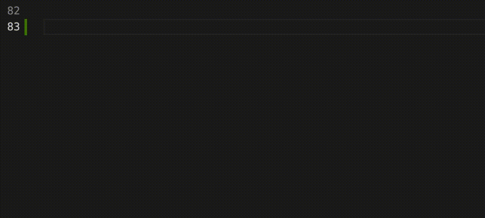

# mvvm_plus (mvvm+) extension

A snippet for adding a View and ViewModel classes for the mvvm_plus package.

## Features

Just start typing "mvvm+" in the edit window and hit `Enter`. This extension adds the classes. Then start typing the name of you widget and this extension will populate the naming for you. Hit tab to edit the build function.

Works similarly to how 'stful' adds StatefulWidget and State classes.

## Requirements

Install the `mvvm_plus` package from pub.dev. See [mvvm_plus](https://pub.dev/packages/mvvm_plus)